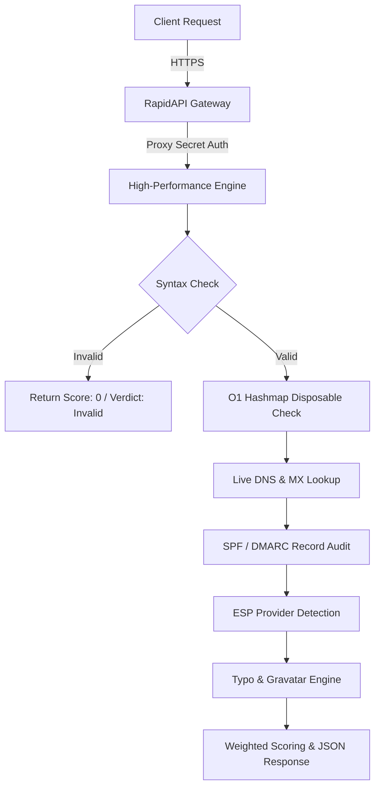

# ⚡ High-Performance Disposable Email & Deliverability Verification API

[](https://opensource.org/licenses/MIT)
[](https://rapidapi.com)
[](https://www.php.net/)
[](https://rapidapi.com)

A lightweight, enterprise-grade **Email Verification Microservice API** designed to block temporary/disposable emails, detect spam accounts, verify live MX/DNS records, validate SPF/DMARC compliance, and calculate deliverability scores in real-time.

---

## 🏗️ Architecture & Request Flow



---

## 🔥 Key Features

- 🛑 **Disposable & Temp Mail Detection:** Real-time checking against a dynamically updated database of 8,000+ temporary email domains (auto-synced every 24 hours via Cron).
- ⚡ **Sub-15ms Ultra-Fast Quick Check:** Zero-network-delay endpoint (`/v1/quick`) for instant syntax & disposable validation.
- 📬 **Live MX & DNS Inspection:** Validates if the domain actually accepts emails via live DNS lookup.
- 🛡️ **SPF & DMARC Analysis:** Security record checking for advanced fraud prevention.
- 💡 **Smart Typo Engine:** Automatically detects typos (e.g. `user@gmal.com` ➔ `user@gmail.com`).
- 🏢 **ESP Provider Identification:** Identifies major providers (Google Workspace, Microsoft 365, ProtonMail, SendGrid, Zoho, Yandex, etc.).
- 👤 **Role-Based Email Check:** Flags generic departmental emails (`admin@`, `support@`, `sales@`, `billing@`).
- 🔐 **Zero Data Retention (GDPR & CCPA Compliant):** Queries are processed in-memory and instantly discarded. No user emails are logged to disk.

---

## 🏷️ API Endpoints & Performance Benchmarks

| Endpoint | Method | Average Latency | Description | Ideal Use Case |
| :--- | :---: | :---: | :--- | :--- |
| `/v1/verify` | `GET` | 30 - 80 ms | Deep validation including MX, SPF, DMARC, ESP Provider, Gravatar, and Score. | User Registration, Lead Generation |
| `/v1/quick` | `GET` | **< 15 ms** | Ultra-fast check (Syntax + Disposable + Typo) with zero network delay. | High-Speed Form Validation |
| `/v1/batch` | `POST` | 300 - 600 ms | Verify up to 100 emails in a single JSON payload. | Database Cleanups, CSV Processing |
| `/ping` | `GET` | **< 5 ms** | Public health check monitoring endpoint. | Automated Server Uptime Checks |

---

## 📖 JSON Response Field Dictionary

| Field | Type | Description |
| :--- | :---: | :--- |
| `verdict` | `string` | `valid`, `invalid`, or `risky`. Final deliverability classification. |
| `score` | `integer` | `0 - 100` weighted quality score based on syntax, MX, SPF, DMARC, and domain reputation. |
| `risk_level` | `string` | `low`, `medium`, or `high` risk assessment. |
| `recommendation` | `string` | Recommended action: `send`, `do_not_send`, or `send_with_caution`. |
| `is_disposable` | `boolean` | `true` if domain belongs to a temporary/disposable mail service (e.g., Mailinator). |
| `has_mx_records` | `boolean` | `true` if domain has active MX mail server records registered. |
| `is_free_email` | `boolean` | `true` if domain is a personal free provider (`@gmail.com`, `@outlook.com`). |
| `is_role_email` | `boolean` | `true` if username is a departmental role address (`admin@`, `info@`, `support@`). |
| `has_spf_record` | `boolean` | `true` if domain has a valid SPF DNS record (`v=spf1`). |
| `has_dmarc_record` | `boolean` | `true` if domain has a DMARC policy configured. |
| `esp_provider` | `string` | Identified mail service provider (e.g. `Google Workspace / Gmail`, `Microsoft 365`). |
| `did_you_mean` | `string` | Typo correction suggestion if a typo is detected (e.g. `user@gmail.com`). |

---

## 🛠️ Integration Examples

### 1. Node.js / JavaScript (Fetch)

```javascript
const url = 'https://email-checker-deliverability-verification-api.p.rapidapi.com/v1/verify?email=test%40gmail.com';
const options = {
  method: 'GET',
  headers: {
    'x-rapidapi-key': 'YOUR_RAPIDAPI_KEY',
    'x-rapidapi-host': 'email-checker-deliverability-verification-api.p.rapidapi.com'
  }
};

try {
  const response = await fetch(url, options);
  const result = await response.json();
  console.log(result);
} catch (error) {
  console.error('Error verifying email:', error);
}
```

### 2. Python (requests)

```python
import requests

url = "https://email-checker-deliverability-verification-api.p.rapidapi.com/v1/verify"
querystring = {"email": "user@mailinator.com"}

headers = {
    "x-rapidapi-key": "YOUR_RAPIDAPI_KEY",
    "x-rapidapi-host": "email-checker-deliverability-verification-api.p.rapidapi.com"
}

response = requests.get(url, headers=headers, params=querystring)
print(response.json())
```

### 3. PHP (cURL)

```php
<?php
$curl = curl_init();

curl_setopt_array($curl, [
    CURLOPT_URL => "https://email-checker-deliverability-verification-api.p.rapidapi.com/v1/verify?email=user%400815.ru",
    CURLOPT_RETURNTRANSFER => true,
    CURLOPT_HTTPHEADER => [
        "x-rapidapi-host: email-checker-deliverability-verification-api.p.rapidapi.com",
        "x-rapidapi-key: YOUR_RAPIDAPI_KEY"
    ],
]);

$response = curl_exec($curl);
curl_close($curl);

echo $response;
```

### 4. Go (Native HTTP)

```go
package main

import (
	"fmt"
	"io"
	"net/http"
)

func main() {
	url := "https://email-checker-deliverability-verification-api.p.rapidapi.com/v1/verify?email=test%40gmail.com"
	req, _ := http.NewRequest("GET", url, nil)

	req.Header.Add("x-rapidapi-key", "YOUR_RAPIDAPI_KEY")
	req.Header.Add("x-rapidapi-host", "email-checker-deliverability-verification-api.p.rapidapi.com")

	res, err := http.DefaultClient.Do(req)
	if err != nil {
		fmt.Println("Error:", err)
		return
	}
	defer res.Body.Close()

	body, _ := io.ReadAll(res.Body)
	fmt.Println(string(body))
}
```

### 5. cURL (Command Line)

```bash
curl --request GET \
	--url 'https://email-checker-deliverability-verification-api.p.rapidapi.com/v1/verify?email=test%40gmail.com' \
	--header 'x-rapidapi-host: email-checker-deliverability-verification-api.p.rapidapi.com' \
	--header 'x-rapidapi-key: YOUR_RAPIDAPI_KEY'
```

---

## 📊 Sample Response Schema

```json
{
  "status": "success",
  "email": "user@gmail.com",
  "user": "user",
  "domain": "gmail.com",
  "verdict": "valid",
  "score": 90,
  "risk_level": "low",
  "recommendation": "send",
  "validations": {
    "is_valid_syntax": true,
    "is_disposable": false,
    "has_mx_records": true,
    "is_free_email": true,
    "is_role_email": false,
    "has_spf_record": true,
    "has_dmarc_record": true,
    "has_gravatar": false
  },
  "details": {
    "esp_provider": "Google Workspace / Gmail",
    "clean_email": "user@gmail.com",
    "did_you_mean": null
  },
  "execution_time_ms": 14.2
}
```

---

## 🔒 Security & Privacy

We adhere strictly to international data protection guidelines:
- **Zero Data Retention:** Emails are processed in-memory and never cached or written to disk.
- **GDPR & CCPA Compliant:** Full compliance with European and International privacy regulations.
- **SSL Encryption:** 256-bit SSL encryption across all API requests.

---

## 📝 License

This project documentation and integration wrapper are released under the [MIT License](LICENSE).
